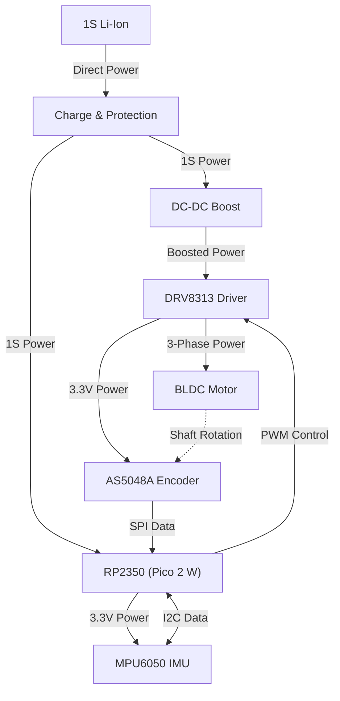

# Hardware Overview

This section covers the electronic and physical components of the Triangle robot.

## Wiring & Block Diagram

## Pinout Mapping

| Component   | Pin Function | GPIO Pin  |
| :---        | :---         | :---      |
| **MPU6050** | SDA          | `GPIO 26` |
|             | SCL          | `GPIO 27` |
| **AS5048A** | SCK          | `GPIO 2`  |
|             | MOSI         | `GPIO 3`  |
|             | MISO         | `GPIO 4`  |
|             | CS           | `GPIO 5`  |
| **DRV8313** | PWM A        | `GPIO 10` |
|             | PWM B        | `GPIO 11` |
|             | PWM C        | `GPIO 12` |
|             | EN           | `GPIO 13` |
